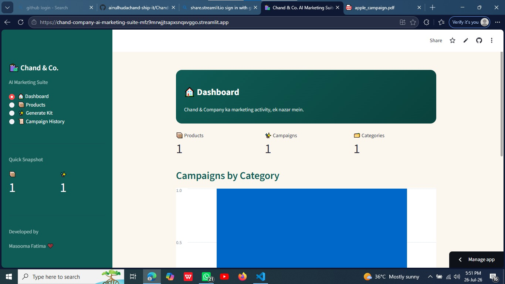
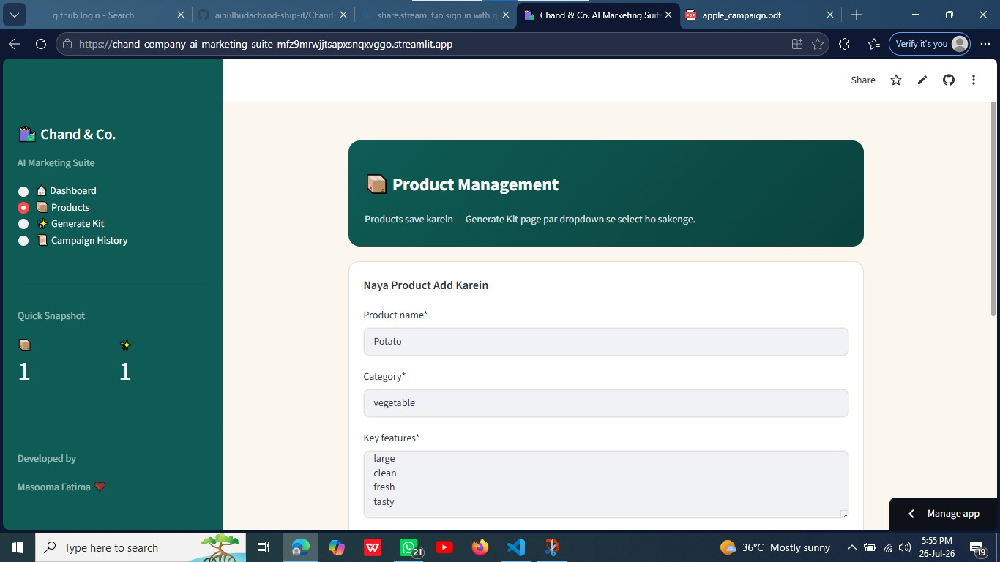
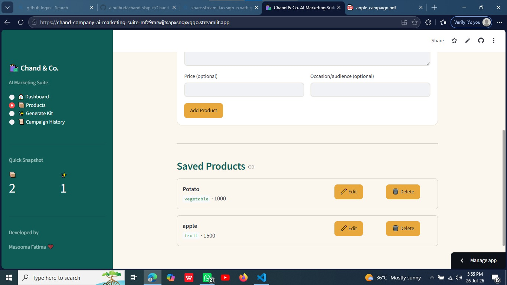
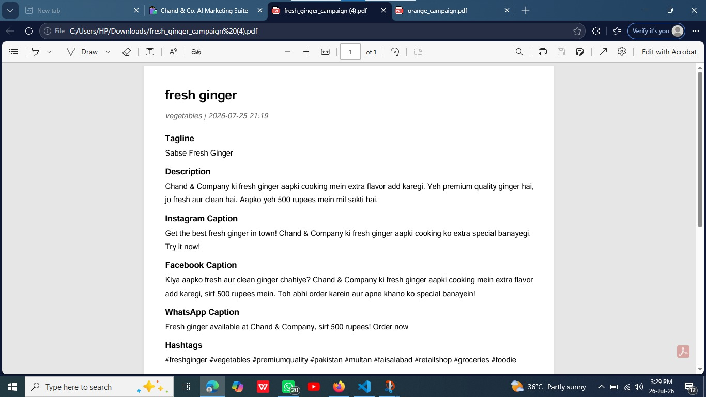
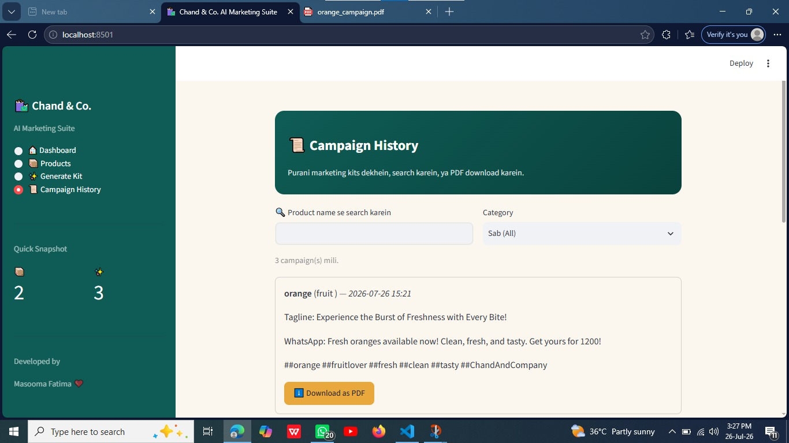

# 🛍️ Chand & Company AI Marketing Suite

An AI-powered marketing assistant built for **Chand & Company**, a retail shop with branches in Multan and Faisalabad, Pakistan. Small shop owners lose real time and money creating promotional content by hand. This app lets them describe a product once and instantly get a complete marketing kit — tagline, description, platform-specific social captions, hashtags, and a poster image — plus a product catalog, a dashboard, and full campaign history.

## 🔗 Live App
**[https://chand-company-ai-marketing-suite-mfz9mrwjjtsapxsnqxvggo.streamlit.app/]**

## ✨ Features
- **Dashboard** — total products, total campaigns, campaigns-by-category chart, recent activity, and an on-demand AI marketing tip
- **Product Management** — add, edit, and delete a saved catalog of products
- **AI Marketing Kit Generator** — tagline, description, Instagram/Facebook/WhatsApp captions, and hashtags generated from a product's details (pick a saved product or enter one manually)
- **AI Poster Generator** — a matching promotional poster image for every kit
- **AI Marketing Tips** — short, practical tips for the shop's product categories
- **Campaign History** — search and filter every past campaign, download any one as a PDF
- **Sidebar navigation** across all pages

## 🤖 AI Feature — How It Works
The core AI feature calls the **Google Gemini API** (`gemini-2.5-flash`) with a custom prompt that:
- Positions the model as a marketing copywriter for a small Pakistani retail shop
- Passes in the product's name, category, features, price, and target occasion
- Asks for a tagline, description, three platform-specific captions, and hashtags — mixing Roman Urdu and English the way real Pakistani shop ads sound
- Requires a strict JSON response, which the app parses and displays

A second, simpler Gemini prompt powers the standalone **AI Marketing Tips** feature. Poster images are generated separately through **Pollinations.ai**, a free, keyless image-generation API — so the AI feature keeps working even before you've set up anything beyond a Gemini key.

## 🛠️ Tools & Services
| Purpose | Tool / Service |
|---|---|
| App framework | Streamlit |
| AI text generation | Google Gemini API (free tier) |
| AI image generation | Pollinations.ai (free, no key) |
| Database | SQLite |
| PDF export | fpdf2 |
| Charts | pandas + Streamlit native charts |

## 📁 Project Structure
```
├── app.py                        # Main app: sidebar navigation + all pages
├── db.py                         # SQLite logic (products + campaigns)
├── ai_service.py                  # Gemini + Pollinations calls
├── pdf_service.py                  # Campaign PDF export
├── requirements.txt
├── .gitignore
└── .streamlit/
    └── secrets.toml.example        # Template — the real secrets.toml is gitignored
```

## 🗄️ Database Schema
**products** — `id, name, category, features, price, occasion, created_at`
**campaigns** — `id, product_name, category, tagline, description, instagram_caption, facebook_caption, whatsapp_caption, hashtags, image_url, created_at`

## ▶️ How to Run Locally
1. Get a free Gemini API key at [aistudio.google.com](https://aistudio.google.com) — no credit card needed
2. Copy `.streamlit/secrets.toml.example` to `.streamlit/secrets.toml` and paste your key in:
   ```toml
   GEMINI_API_KEY = "your-real-key-here"
   ```
3. Install dependencies:
   ```
   pip install -r requirements.txt
   ```
4. Run the app:
   ```
   streamlit run app.py
   ```

## 🚀 Deploying (free, via Streamlit Community Cloud)
1. Push this repo to GitHub as a **public** repository — `.streamlit/secrets.toml` never gets committed, thanks to `.gitignore`
2. On [share.streamlit.io](https://share.streamlit.io), connect the repo and set `app.py` as the main file
3. In the app's **Settings → Secrets**, add:
   ```toml 
   GEMINI_API_KEY = "your-real-key-here"
   ```
4. Copy the live URL into the **Live App** section above

## 📸 Screenshots














## 👤 Author
Masooma — CS&IT student, The Women University Multan